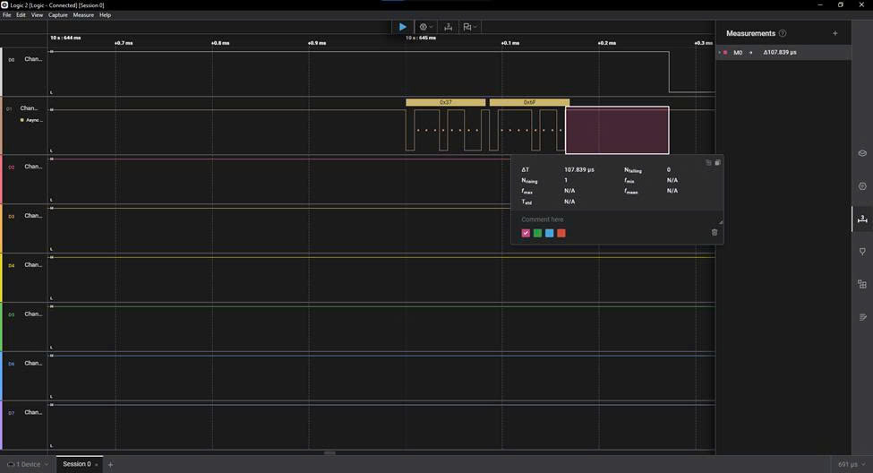
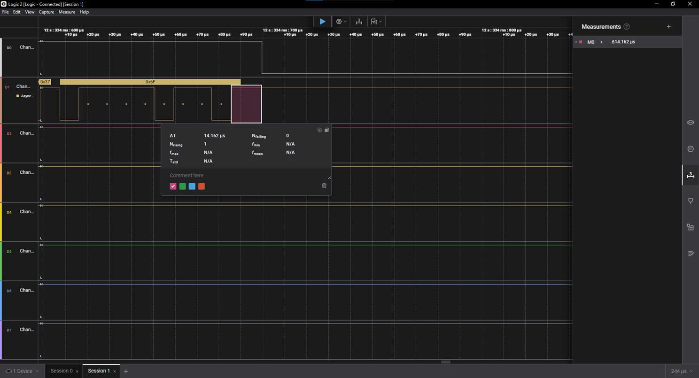

## HAL vs Register-Level Response Time Comparison

# HAL

# Register-level

### Conclusion

With the same control logic and UART command processing algorithm, the register-level implementation achieved a significantly faster response time than the STM32 HAL implementation. Specifically, the response time of the HAL version was approximately `7,6` times slower than the register-level version.

This difference comes from the abstraction overhead introduced by HAL functions, while the register-level implementation directly accesses peripheral registers and reduces unnecessary software layers. However, HAL still provides advantages in readability, portability, and development speed, making it suitable for rapid prototyping and peripheral initialization.

Through this comparison, I gained a clearer understanding of the trade-off between development convenience and execution efficiency in embedded systems.